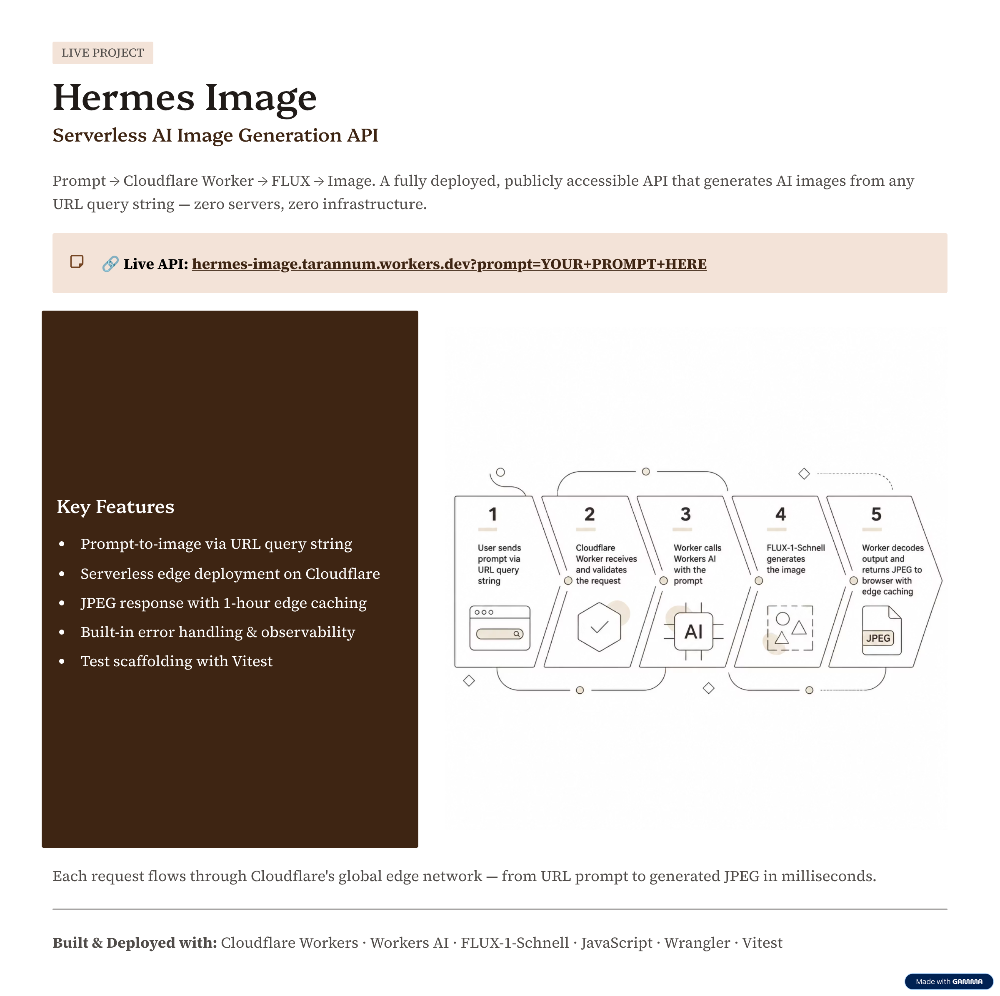

# Hermes Image — Serverless AI Image Generation API

A lightweight serverless text-to-image API built with **Cloudflare Workers AI** and **FLUX-1-Schnell**.

The API accepts a text prompt through a URL and returns the generated image directly as a JPEG.

---

## 🚀 Live Demo

**Live API:**  
https://hermes-image.tarannum.workers.dev/

### Try It

Open this URL in your browser:

https://hermes-image.tarannum.workers.dev/?prompt=A%20futuristic%20city%20at%20night

---

## 📸 Screenshots

### Project Overview



### Generated Image


---

## ✨ What It Does

```text
User / Browser
      ↓
HTTP Request with Prompt
      ↓
Cloudflare Worker
      ↓
Cloudflare Workers AI
      ↓
FLUX-1-Schnell
      ↓
Generated Image
      ↓
JPEG Response

The worker handles the request, sends the prompt to the FLUX model through Cloudflare Workers AI, decodes the generated result, and returns the image directly to the browser.

🛠️ Tech Stack
JavaScript
Cloudflare Workers
Cloudflare Workers AI
FLUX-1-Schnell
Wrangler
Vitest
Serverless / Edge Computing
🔑 Key Features
Prompt-to-image generation through a simple HTTP endpoint
Serverless deployment on Cloudflare Workers
Cloudflare Workers AI integration
FLUX-1-Schnell image generation
Direct JPEG image response
Edge caching for repeat requests
Basic error handling
Worker observability configuration
Vitest testing setup
⚙️ How It Works
The user sends a prompt using the prompt URL parameter.
The Cloudflare Worker receives the request.
The prompt is passed to Cloudflare Workers AI.
FLUX-1-Schnell generates the image.
The generated output is decoded.
The worker returns the image as image/jpeg.
Cloudflare edge caching can serve repeat requests faster.
Example Request
GET /?prompt=A%20minimalist%20mountain%20landscape
📁 Project Structure
hermes-image/
├── src/
│   └── index.js
├── test/
├── Output_Screenshots/
│   ├── Screenshot 2026-08-15 135533.png
│   └── Screenshot 2026-08-15 135554.png
├── package.json
├── package-lock.json
├── wrangler.jsonc
├── vitest.config.js
├── .gitignore
└── README.md
💻 Local Development
Install Dependencies
npm install
Start the Local Development Server
npm run dev
Deploy to Cloudflare
npm run deploy
☁️ Deployment

The project is deployed using Cloudflare Workers with a Workers AI binding connected to the FLUX-1-Schnell model.

Live endpoint:

https://hermes-image.tarannum.workers.dev/

🎯 Why I Built This

I wanted to build a lightweight AI image-generation service without relying on a traditional backend server.

This project gave me hands-on experience with:

Serverless AI architecture
Cloudflare Workers
Foundation-model integration
HTTP API design
Image response handling
Edge caching
Deployment and observability
🔮 Future Improvements
Prompt validation and sanitization
Authentication and API usage limits
Request logging and analytics
Additional image-generation models
Configurable image parameters when supported by the selected model
Frontend interface for non-technical users
👤 Author

Tarannum Khan
AI Automation Engineer

LinkedIn • GitHub
